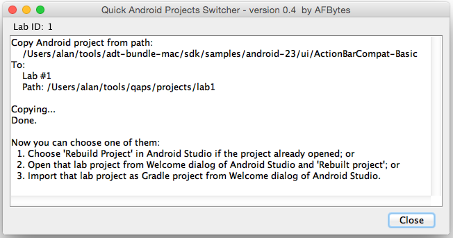
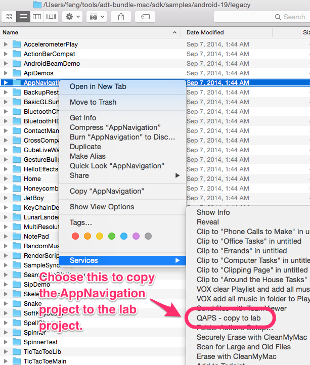
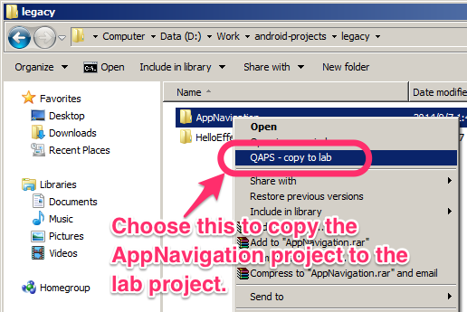
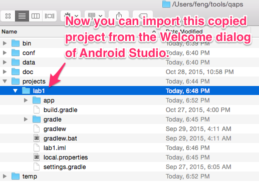

# quick-android-projects-switcher
Quick Android Projects Switcher(QAPS) is a GUI or Command Line tool which helps you to experience Android sample projects without involving too many projects and uninstalling the installed apps from your device or emulator.

It's tested on Android Studio 1.4 and with OS's:

* Mac OS X 10.10.4
* Windows 7

What Is It
==========
When you want to read the code of Android sample projects, you have to open them by Eclipse or Android Studio etc. The drackbacks of this common way are:

* you have to migrate the project if it's in legacy format, like the sample projects in the Android SDK.
* each opened project will be compile and it leads to the disk space consumption, and you have to clean them.
* you get many apps installed to your device or emulator if you launch them, and you have to uninstall them one by one.

QAPS is developed to handle aforementioned issues. With QAPS,

* you can (1) copy the target project to the "lab projects" by a running a command or (2) click on the item in the Contextual Menu in Finder (Mac OS X) or File Explorer (Windows).
* you just need to Rebuild the just copied project in Android Studio (ok, in most cases) without closing Android Studio or import a new project.
* you do not get too many samples apps on your device or emulator, since QAPS change the "applicationId" or the copied project.

BTW, QAPS only works with Android Studio.

This is the result of copying a project to lab:


Installation
============
You just need to copy the release directory to your disk, and add the "bin" directory to your $PATH if you like.

  * **It is suggested that you just clone this repository and use it directly, since the "$/projects" directory is configured to be ignored by Git.**

To integrate QAPS to the Contextual Menu in Finder (Mac OS X) or File Explorer (Windows), you just need to:

* for Mac OS X - just run the "bin/macosx_register_context_menu.sh" in the package directory and confirm when be prompted.
* for Windows - just run the "bin/win_register_context_menu.bat" in the package and confirm when be prompted.

Uninstallation
============
You can just delete the download package directory, or you need to run these command to remove the Contextual Menu item if you have integrated them:

* for Mac OS X : "bin/macosx_unregister_context_menu.sh" in the package directory.
* for Windows : "bin/win_unregister_context_menu.bat" in the package directory.


How to Run It
=============
After the installation, you can run QAPS in the Command Line way or GUI way.

1. Command Line way
-------------------
Open a console, and run like this (assume that you add the "$/bin" to the $PATH):

```
konHKT:~ feng$ qaps.sh copy ~/tools/adt-bundle-mac/sdk/samples/android-19/legacy/AppNavigation
Copy Android project from path:
    /Users/feng/tools/adt-bundle-mac/sdk/samples/android-19/legacy/AppNavigation
To:
    Lab #1
    Path: /Users/feng/tools/qaps/projects/lab1

Copying...
Done.

Now you can choose one of them:
  1. Choose 'Rebuild Project' in Android Studio if the project already opened; or
  2. Open that lab project from Welcome dialog of Android Studio and 'Rebuilt project'; or
  3. Import that lab project as Gradle project from Welcome dialog of Android Studio.
konHKT:~ feng$
```

2. GUI way
----------

(1) Choose the "QAPS - copy to lab" item on the Contextual Menu on Mac OS X or Windows.

* on Mac OS X:



* on Windows (Windows 7):



(2) This is the result of copying a project to lab (Mac OS X):


(3) The project is copied to the lab directory which is in the "$/projects/lab<N>":


